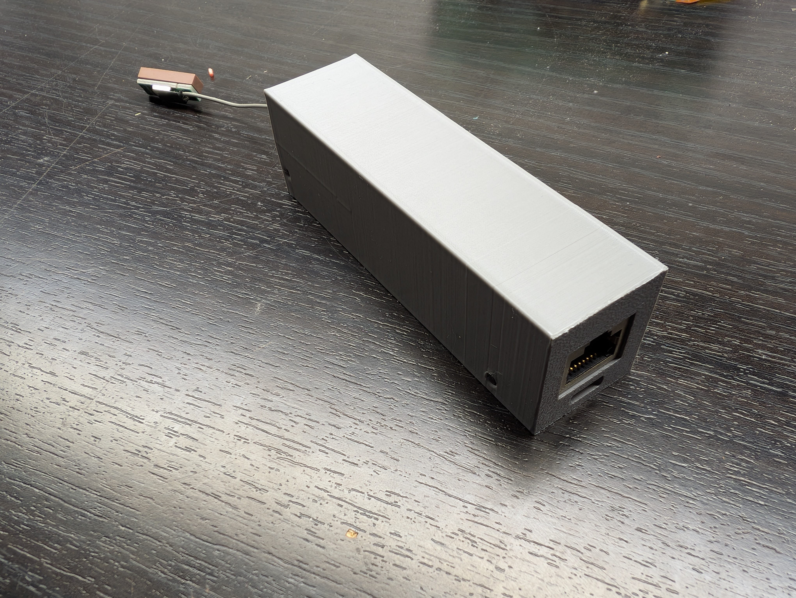

# ESP32 PPS Time Server

I started this project when I was having trouble finding an ESP32-based PPS (Pulse Per Second) time server that compiled on a recent version of Arduino and had the features I wanted. This project provides a reliable, high-accuracy NTP server solution using an ESP32 with Ethernet support and Power over Ethernet (PoE).

## 🚀 Overview

This repository contains the firmware and 3D-printable housing for a Network Time Protocol (NTP) server. By utilizing the PPS signal from a GPS module, this server provides microsecond-level timing accuracy to your local network. 

The project is designed for the **Waveshare ESP32-S3-ETH**, but it should be easily adaptable to most ESP32 Ethernet boards and GPS modules with a PPS output.

## 🛠 Hardware Used

* **Microcontroller:** [Waveshare ESP32-S3-ETH](https://www.waveshare.com/esp32-s3-eth.htm) (Supports PoE)
* **GPS Module:** [Beitian BN-220 GPS/Glonass](https://a.co/d/dijGAva)
* **Power:** Runs directly off **PoE** via the Waveshare board, or can be powered via **USB-C**.

### Wiring Connections

| BN-220 GPS Pin | ESP32-S3-ETH Pin | Description |
| :--- | :--- | :--- |
| **VCC** | 3.3V or 5V | Power supply for GPS |
| **GND** | GND | Ground |
| **TX** | GPIO 5 (RX) | GPS Data Transmission |
| **RX** | GPIO 4 (TX) | GPS Data Reception |
| **PPS** | GPIO 1 | Pulse Per Second (High Precision) |

*Please verify these GPIO assignments in `ESP32TimeServer/ESP32TimeServer.ino` before powering on.*

## 📂 Project Structure

* **`/ESP32TimeServer`**: The Arduino sketch folder containing the source code.
* **`Case.stl`**: 3D-printable main housing for the electronics.
* **`LockBlock.stl`**: 3D-printable locking mechanism/mount.

## 🔧 Installation & Setup

1.  **Hardware:** Wire the BN-220 to the Waveshare board as shown in the table above.
2.  **Arduino IDE:** * Open `ESP32TimeServer.ino`.
    * Ensure the **ESP32 board manager** is installed (v2.0.x+).
    * Select **ESP32-S3 Dev Module** (or the specific Waveshare board profile if installed).
3.  **Flash:** Upload the code to the board via USB-C.
4.  **Enclosure:** Print the provided `.stl` files. The board is designed to snap into the case, secured by the LockBlock.
